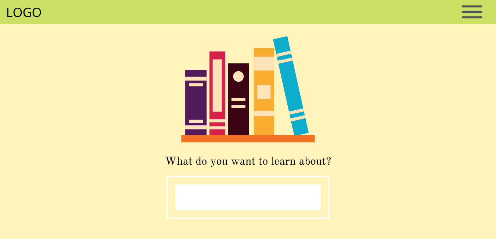
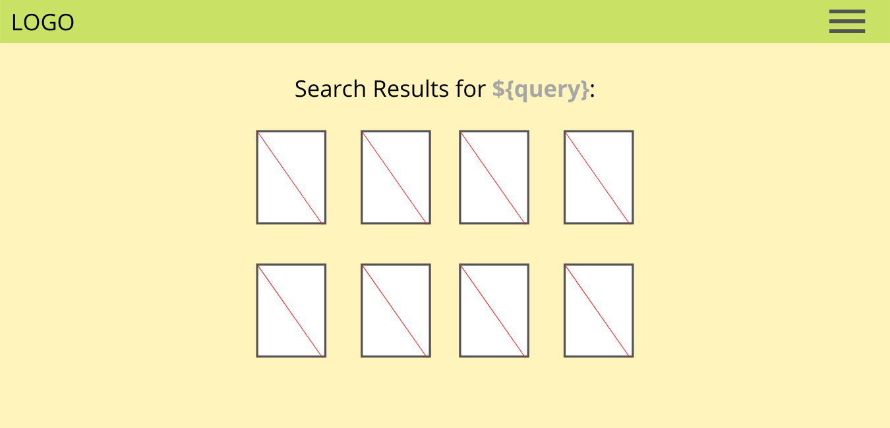
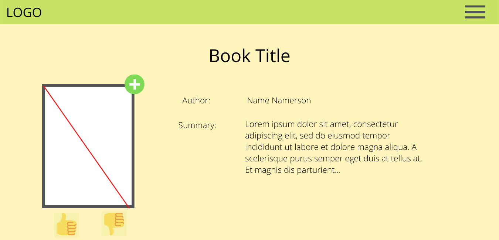

# Booxploration - front end

[**Deployed APP**](https://booxploration.herokuapp.com/)

[**Link to Backend Repo**](https://github.com/lind1125/Project_4_backend)

---

### Technologies used:

* React
* Bootstrap
* react-router-dom
* react-validation
* axios
* [Open Library API](https://openlibrary.org/developers/api)

---

### Installation instructions:

* Fork and clone repo
* run `npm install` in the command line
* setup back end
* `npm start`

---
### General Approach

The idea behind the app is to encourage dicovery of new books based on subjects of interest. The landing page consists only of a search query input which queries the Open Library [Subjects API](https://openlibrary.org/dev/docs/api/subjects), which then returns a list of results, which are rendered on the same page. Each query result links to a component which pulls details from the API on that particular book. From here, the user can add the book to their own personal list, which creates a new entry in the faved books table on the back end database.

The user profile component lists user information as well as any books associated with that user on the back end database. From there, the user can delete a book (clear from the database) as well as mark it as read (update the has_read boolean for that entry in the database).

---

###  Wireframes
#### Landing page

---
#### Search query results

---
#### Book details page

---

### User stories

* As a user, I want to be able to create a user account.
* As a user, I want to be able to search for a subject and get a a list of associated books in return.
* As a user, I want to get more details about a book by clicking on it in my search results.
* As a user, I want to be able to add a book to my personal list associated with my account.
* As a user, I want to be able to delete a book from my persona list.
* As a user, I want to be able to indicate thave I have read a book.
* As a user, I want to be able to rate and/or review a book so that others may see it _(**STRETCH GOAL**)_
*  As a user, I want to see how other users have rated and/or reviewed a book _(**STRETCH GOAL**)_

---
### Major Hurdles

While the app itself is relatively simple, I am still learning how to manage state, particularly when I need to pass data back and forth from a back end. As I built out the front end, much refactoring was needed on both ends to get them to communicate properly.

The Open Library API proved more complicated than expected, as certain information was avaiable only from certain endpoints, so it was a matter of figuring out which calls needed to be made depending on what needed to be rendered. The data is also not entirely consistent. Descriptions of books, when they even existed, were sometimes presented as their own key value pair, and at other times as a key value pair within an embedded object, so some conditionals needed to be added in the rendering of the book details component to account for that. 

Due to those challenges, the front end is still very much at MVP, with the minimal styling only coming from some minimal usage of classes native to Bootstrap. A stretch goal will be to add more styling as well as refine some functionality for a better user experience.

### Acknowledgements

* Thank you to the GA team giving me the tools to explore this language/framework

* Big thanks to Room 5 for the frequent debugging help and the constant camaraderie
